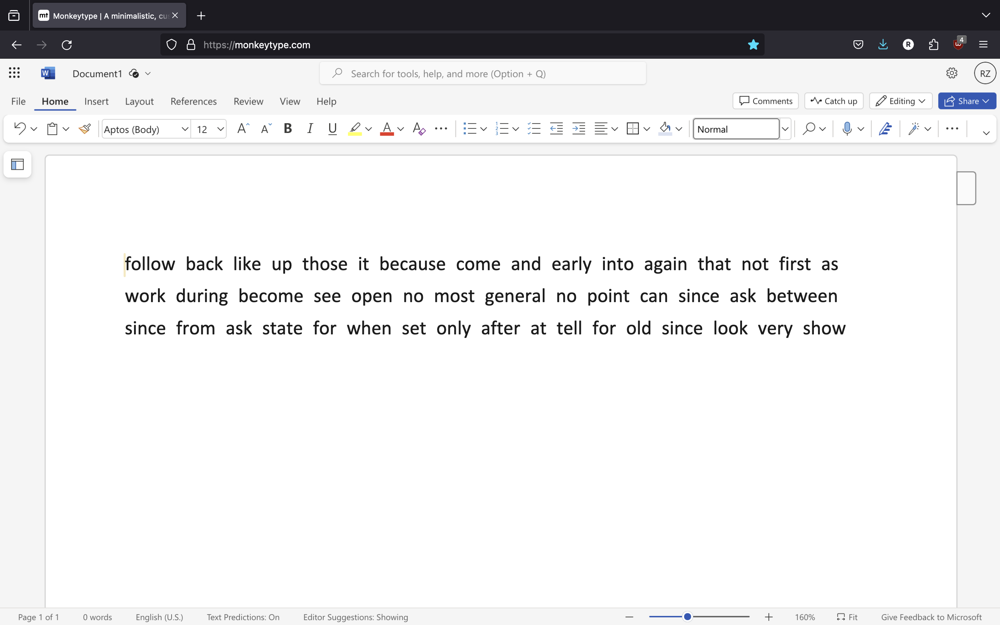

# MonkeyType Microsoft Word Document Theme
Microsoft Word Document Theme on Monkeytype

This is a MonkeyType Microsoft Word Document Theme. 
It includes optional settings, and importantly, css code to remove undesired elements. 



# Monkeytype Word Theme Guide:
_______________________________________________________

## Font:
You can either download the font from this repository or download it at: https://www.downloadfonts.io/downloads/calibri-font/

This allows you to have it as a custom font in Monkeytype.

Open the TTF file to install it on your computer.

If you have installed it from the website, unzip file and install the TTF called calibri-regular.ttf

Then, you can to monkeytype.com, press escape (Command Line) => Font Family => custom... => Type "Calibri"
———————————————————————————————————————————————————————

## MonkeyType Settings. 
(Go to https://monkeytype.com/settings, scroll down to "Danger Zone", and click "import". Then copy paste the settings below.)

 
 **Settings to Import**

```json
{"theme":"vscode","themeLight":"serika","themeDark":"serika_dark","autoSwitchTheme":false,"customTheme":true,"customThemeColors":["#ffffff","#000000","#e2b714","#1c1c1c","#2c2e31","#000000","#ca4754","#7e2a33","#ca4754","#7e2a33"],"favThemes":[],"showKeyTips":false,"smoothCaret":"medium","quickRestart":"tab","punctuation":false,"numbers":false,"words":10,"time":15,"mode":"time","quoteLength":[3],"language":"english","fontSize":1.8,"freedomMode":false,"difficulty":"normal","blindMode":false,"quickEnd":false,"caretStyle":"default","paceCaretStyle":"underline","flipTestColors":false,"layout":"default","funbox":"none","confidenceMode":"off","indicateTypos":"below","timerStyle":"mini","liveSpeedStyle":"off","liveAccStyle":"off","liveBurstStyle":"off","colorfulMode":true,"randomTheme":"off","timerColor":"main","timerOpacity":"0.25","stopOnError":"off","showAllLines":false,"keymapMode":"off","keymapStyle":"staggered","keymapLegendStyle":"lowercase","keymapLayout":"colemak","keymapShowTopRow":"layout","fontFamily":"Calibri","smoothLineScroll":true,"alwaysShowDecimalPlaces":true,"alwaysShowWordsHistory":false,"singleListCommandLine":"manual","capsLockWarning":false,"playSoundOnError":"off","playSoundOnClick":"off","soundVolume":"1.0","startGraphsAtZero":true,"showOutOfFocusWarning":false,"paceCaret":"pb","paceCaretCustomSpeed":190,"repeatedPace":true,"accountChart":["off","on","on","on"],"minWpm":"off","minWpmCustomSpeed":100,"highlightMode":"letter","typingSpeedUnit":"wpm","ads":"off","hideExtraLetters":false,"strictSpace":false,"minAcc":"off","minAccCustom":90,"monkey":false,"repeatQuotes":"off","oppositeShiftMode":"off","customBackground":"https://i.imgur.com/PYI1JhQ.png","customBackgroundSize":"cover","customBackgroundFilter":[0,1,1,1],"customLayoutfluid":"qwerty#colemak","monkeyPowerLevel":"off","minBurst":"off","minBurstCustomSpeed":100,"burstHeatmap":false,"britishEnglish":false,"lazyMode":false,"showAverage":"off","tapeMode":"off","maxLineWidth":75}
```

Copy paste this into there. Make sure to backup your previous configuration if you would like to keep that.
————————————————————————————————————————————————————————

## Removing Other Elements
The Stylus extension is required for the CSS code to modify the page. 
(Install Stylus at 
https://chrome.google.com/webstore/detail/stylus/clngdbkpkpeebahjckkjfobafhncgmne or https://addons.mozilla.org/en-US/firefox/addon/styl-us/) 

Visit Monkeytype and open Stylus, then click write style. Then paste the code, press save and enable it.

Copy paste this into style writing page:
```css
#top .logo .text {
    visibility: hidden !important;
}
a#logo {
    display: none !important;
    visibility: hidden !important;
}
a#startTestButton.textButton.view-start{
    visibility:hidden !important;
}
div.icon{
    visibility:hidden !important;
}
div.notificationBubble{
    visibility:hidden !important;
}
div.text{
    visibility:hidden !important;
}
button#contactPopupButton.textButton{
    visibility:hidden !important;
}
button#supportMeButton.textButton{
    visibility:hidden !important;
}
button#contactPopupButton.textButton{
    visibility:hidden !important;
}
a.textButton{
    visibility:hidden !important;
}
button.current-theme.textButton{
    visibility:hidden !important;
}
button.currentVersion.textButton{
    visibility:hidden !important;
}
a.textButton.account.view-account{
    visibility:hidden !important;
}
#top .logo .text .top {
    visibility: hidden; 
}
div.textButton {
    visibility:hidden;
}

#top .logo .icon{
    visibility: hidden !important;
}
#top .logo .bottom {
    visibility: hidden;
}

#bottom {
visibility: hidden;
}

#top .icon {
visibility: hidden;
}
#top .account {
visibility: hidden;
}
#top .notifications {
visibility: hidden;
}
#menu {
visibility: hidden;
display: none;
}   
#testConfig {
visibility: hidden;
}
#typingTest {

    transform: translateY(-140px);
    margin-left: 10%;
    margin-right: 10%;
}

#commandLine {
    background: none !important;
}
#commandLineWrapper {
    background: none;
    backdrop-filter: blur(5px) brightness(0.5);
    transition: 0.5s ease;
}
#commandLine input {
    background: none !important;
}
#commandLine > div:first-child {
    border-radius: 0;
    border-bottom: 1px solid var(--sub-color) !important;
}

/* command line scrollbar */
#commandLine .suggestions {
    scrollbar-width: none !important;
    scrollbar-color: rgba(255, 255, 255, .1) transparent !important;
}
#commandLine .suggestions:hover {
    scrollbar-width: thin !important;
}
#commandLine .suggestions::-webkit-scrollbar {
    width: 0px;
}
#commandLine .suggestions:hover::-webkit-scrollbar {
    width: 7px;
}
```
Click save. It should work now! Please create an issue if there is a problem.